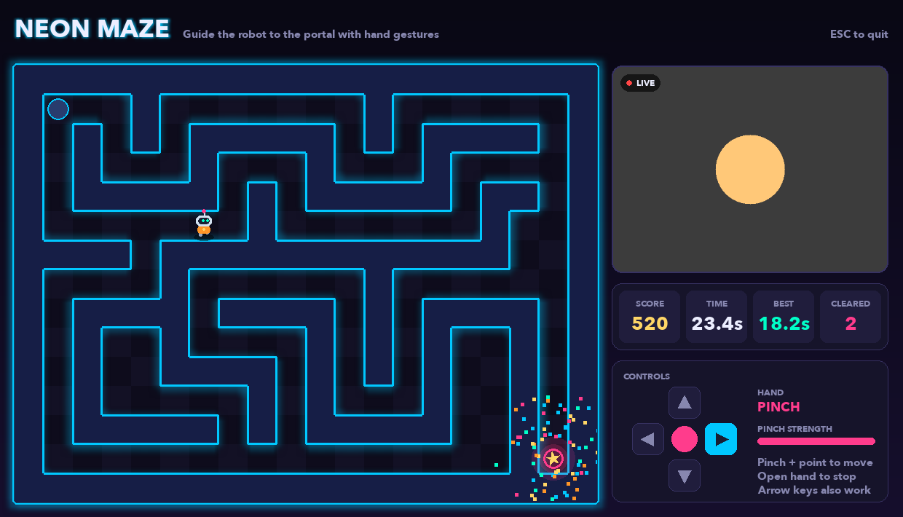

# Neon Maze

A small maze game you play with your hands. Pinch your thumb and index finger together, point your hand in a direction, and the little robot walks that way. Get it to the glowing portal, collect your points, and the maze changes colour for the next stage.



There are two versions in this folder:

- **`maze.py`** is the original desktop game, written in Python with pygame. It uses your laptop's webcam.
- **`neon-maze-web/`** is the same game rebuilt for the browser. It runs on laptops and phones, can be installed like an app, and lets you use your phone as a controller for the game on your laptop.

---

## How to play

1. Hold your hand up in front of the camera.
2. Pinch your thumb and index finger together.
3. While pinching, point your hand **up, down, left or right**. The robot moves that way.
4. Open your hand to stop.
5. Reach the portal in the bottom-right corner to clear the stage.

Each clear is worth **100 points**, plus a speed bonus of up to 200 more (you lose 2 bonus points for every second you take). The timer only starts on your first move, so take your time getting ready.

There's a pinch strength bar on screen. If the robot isn't responding, watch that bar while you pinch and move your hand a little closer to the camera.

The arrow keys work too, if you just want to play.

---

## The desktop game (Python)

### What you need

- macOS (it should also run on Windows and Linux, but it's only been tested on a Mac)
- **Python 3.9 to 3.12.** MediaPipe doesn't support newer versions yet, so Python 3.13+ won't work.
- A webcam

### Setup

You only need to do this once. From the `MAZE` folder:

```bash
python3 -m venv .venv
source .venv/bin/activate
pip install -r requirements.txt
```

### Run it

```bash
cd ~/Desktop/MAZE
source .venv/bin/activate
python maze.py
```

The first time, macOS will ask whether your terminal (or Cursor) can use the camera. Say yes. If you said no by accident, go to **System Settings → Privacy & Security → Camera** and turn it on, then run the game again.

Press **Esc** or close the window to quit.

### Good to know

- If your iPhone is nearby, macOS sometimes offers it as a camera (Continuity Camera). The game looks for the built-in FaceTime camera first, so it should pick the right one.
- Use `opencv-contrib-python-headless` as pinned in `requirements.txt`, not the regular `opencv-python`. The regular package ships its own copy of SDL, which clashes with pygame and crashes the window.

---

## The web version

The web version lives in `neon-maze-web/`. It does everything the desktop game does, and also:

- works on phones (swipe on the maze, or use the on-screen arrows)
- can be installed to your home screen or dock, and works offline after the first visit
- lets you **use your phone as a controller** for the game running on your laptop

Hand tracking runs entirely in your browser. Your camera video never leaves your device.

### What you need

- **Node.js 22 or newer** ([nodejs.org](https://nodejs.org)). 20.19 also works.
- A modern browser: Chrome, Edge, Safari or Firefox

### Setup

```bash
cd ~/Desktop/MAZE/neon-maze-web
npm install
```

The first run downloads the hand tracking model (around 8 MB) into `public/models/`. That happens automatically.

### Play on your laptop

```bash
npm run dev
```

Then open the address it prints, usually [http://localhost:5173](http://localhost:5173). Click **Start with camera** and allow camera access. If you don't have a camera, click **Play without camera** and use the arrow keys.

### Play on your phone, or use your phone as a controller

Phones only allow camera access on secure (`https://`) sites, and your phone can't reach `localhost` on your laptop anyway. The easy fix is a free Cloudflare tunnel, which gives you a temporary public `https://` link to the game running on your laptop.

You'll need two terminal windows.

**Terminal 1: build and serve the game**

```bash
cd ~/Desktop/MAZE/neon-maze-web
npm run build
npm run preview -- --port 4173
```

**Terminal 2: open the tunnel**

```bash
cd ~/Desktop/MAZE/neon-maze-web
npx cloudflared tunnel --url http://localhost:4173
```

After a few seconds it prints a link like `https://some-random-words.trycloudflare.com`. That's your link.

- **To play on your phone:** open that link on your phone.
- **To control the laptop game from your phone:**
  1. Open the link **on your laptop** and click **Phone controller** in the top bar. A QR code and a 5-letter room code appear.
  2. Scan the QR code with your phone's camera.
  3. Tap **Connect** on your phone.
  4. Pick how you want to steer:
     - **Pad**: hold the arrow buttons
     - **Swipe**: hold your thumb down and drag in a direction
     - **Tilt**: tilt the phone (tap Enable first, and the phone will ask for motion access)
     - **Gesture**: prop the phone up and pinch in front of its front camera, just like the laptop game
  5. When you're finished, tap **Done** on the phone. You can also click **Disconnect phone** on the laptop.

Your score and stage show up on the phone, and on Android it buzzes when you clear a stage or bump into a wall.

### If the phone won't connect

- **Use the link from today's tunnel.** Every time you restart the tunnel you get a new link, and old links and QR codes stop working.
- **Keep both terminals running.** If you close either one, or your laptop goes to sleep, the link dies.
- **Scan the QR code again** if you reloaded the laptop page. The room code changes on every reload.
- **Pull down to refresh on the phone** if it looks out of date. The app keeps an offline copy, and sometimes needs one refresh to pick up changes.
- Still stuck? The message under the Connect button usually says what went wrong, such as "No game found with that code".

### Install it as an app

Open the game in Chrome or Edge and click **Install** in the top bar (or the install icon in the address bar). On an iPhone, open it in Safari, tap **Share**, then **Add to Home Screen**.

### All commands

| Command | What it does |
| --- | --- |
| `npm run dev` | Runs the game locally with live reload while you edit |
| `npm run build` | Builds the final version into `dist/` |
| `npm run preview` | Serves the built version, including the phone relay |

---

## Project layout

```
MAZE/
├── maze.py              the desktop game
├── requirements.txt     Python packages for the desktop game
└── neon-maze-web/
    ├── index.html       the game page
    ├── controller.html  the phone controller page
    ├── relay.ts         passes messages between phone and laptop
    ├── scripts/         downloads the hand tracking model and runtime
    ├── public/          icons, plus the downloaded model files
    └── src/
        ├── main.ts        game page: input, camera, phone pairing
        ├── controller.ts  phone controller
        ├── gesture.ts     hand tracking and pinch detection
        ├── game.ts        movement, scoring and stages
        ├── maze.ts        maze layout and colour themes
        ├── render.ts      drawing the neon maze and robot
        └── remote.ts      phone ↔ laptop connection
```

## Built with

- [MediaPipe Hand Landmarker](https://ai.google.dev/edge/mediapipe/solutions/vision/hand_landmarker) for hand tracking
- [pygame](https://www.pygame.org) and [OpenCV](https://opencv.org) for the desktop game
- [Vite](https://vite.dev), TypeScript and [vite-plugin-pwa](https://vite-pwa-org.netlify.app) for the web version
- [PeerJS](https://peerjs.com) and a small WebSocket relay to connect phone and laptop
